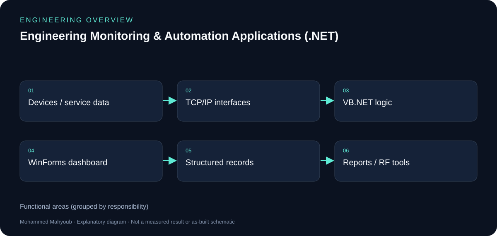

# Engineering Monitoring & Automation Applications (.NET)

## Illustrated engineering guide

[Read the full engineering guide](docs/engineering-guide.md) for architecture, workflow, design rationale, evidence notes and the source gallery.

*Explanatory diagram added for this write-up.*

**Author:** Mohammed Mahyoub.

Developed VB.NET desktop applications and engineering tools for system monitoring, service documentation, repair tracking, operational reporting, device integration, and RF analysis.

## Scope

Structured data management, diagnostics, service records, maintenance workflows, technical calculations, and exportable reports.

## Example

Monitoring & Diagnostics Console — a WinForms dashboard for multi-site system monitoring, real-time diagnostics, automated health evaluation, issue tracking, and technical reporting.

## RF tools

Calculators for path loss, Fresnel-zone clearance, receiver sensitivity, thermal noise, and RF propagation modelling.

## Technologies

VB.NET, WinForms, SQL / Structured Data, Reporting, Engineering Calculations

## Links

- [Portfolio project](https://mahyoub88.github.io/#proj-monitoring-apps)
