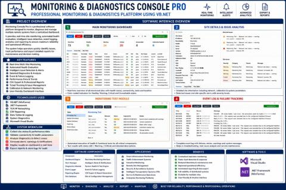
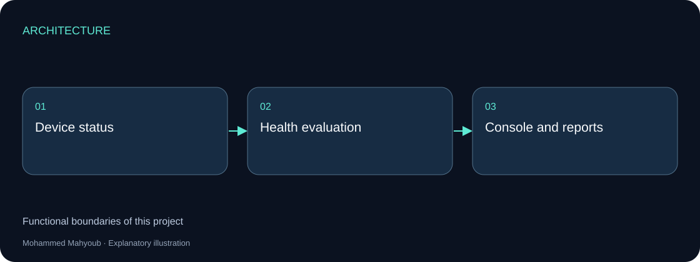
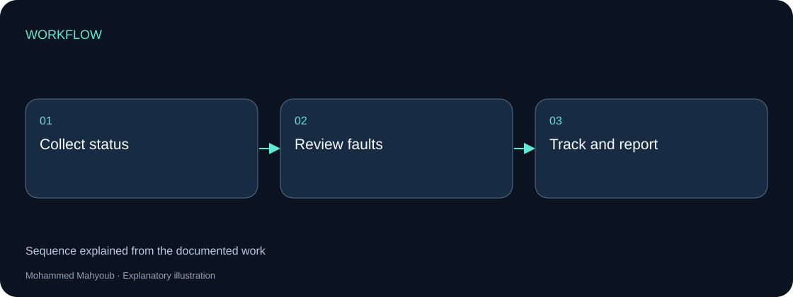
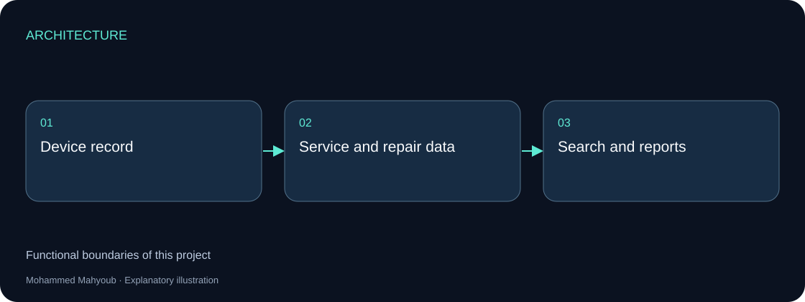
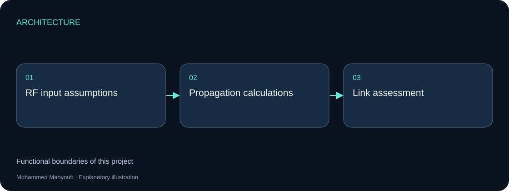
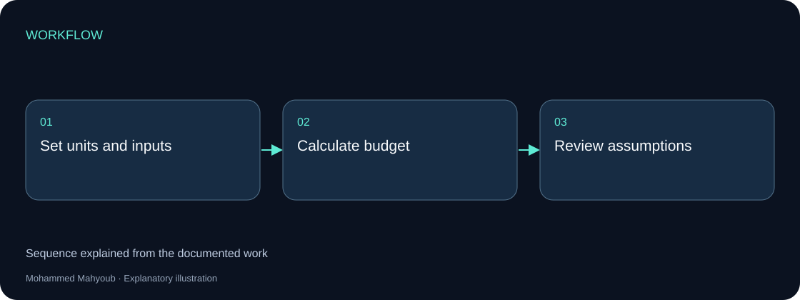
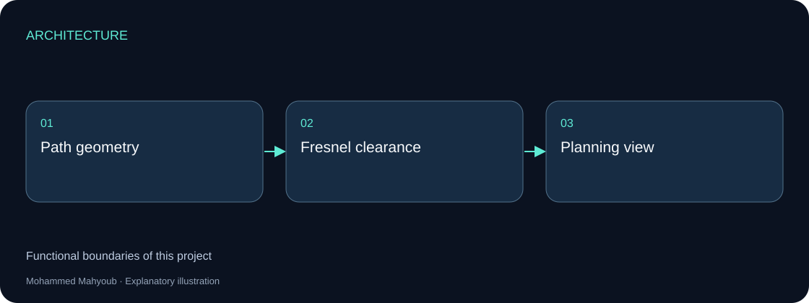

# Engineering Software — Independent Applications

[Browse project collection](https://mahyoub88.github.io/projects/proj-monitoring-apps/) · [Project index](docs/PROJECTS.md) · [Engineering guide](docs/engineering-guide.md)

## Detailed English analysis

[Read the complete interface analysis, proposed designs and calculation review](docs/analysis/engineering-applications-analysis-en.md). The report includes eight diagrams, service-data relationships, verification scenarios, and independently recalculated RF/Fresnel examples. Proposed designs are distinguished from verified implementation details; original project images are preserved.

## Independent implementations

Four independently implemented applications, each with its own purpose, original interface media and engineering explanation.

Each section below is a separate project. Images are existing source project media; the architecture and workflow figures are explanatory diagrams.

### Monitoring & Diagnostics Console — VB.NET

A WinForms dashboard for multi-site system monitoring, diagnostics, health evaluation, issue tracking and technical reporting.

The interface brings device status and operational issues into one review workflow. Health evaluation and report generation serve the operator; the available source preview documents the application rather than a claimed uptime or performance benchmark.

[Full project walkthrough](https://mahyoub88.github.io/projects/proj-monitoring-console/)

### Service Operations & Technical Documentation Management System

A desktop application for device records, repair tracking and service documentation.

The original interface records device details, repair information and warranty/calibration fields. Search and reports turn those records into a service history. This application is presented separately from the monitoring console.

[Full project walkthrough](https://mahyoub88.github.io/projects/proj-service-operations/)

### RF Link Budget & Propagation Analysis Engine

A VB.NET engineering calculator for path loss, receiver sensitivity, thermal noise and link-budget analysis.

The practical output is an engineering calculation that can be reviewed alongside its inputs and units. A link budget supports design decisions; it is not a substitute for a measured field link or an interference survey.

[Full project walkthrough](https://mahyoub88.github.io/projects/proj-rf-link-budget/)

### Line-of-Sight & Fresnel Zone Wireless Planning Tool

A separate planning tool for line-of-sight and Fresnel-zone clearance.

The planning view addresses path geometry and clearance. It complements RF analysis but has its own inputs and output. The source preview is a document/interface view, not a photograph of an installed radio link.

[Full project walkthrough](https://mahyoub88.github.io/projects/proj-fresnel-planning/)
