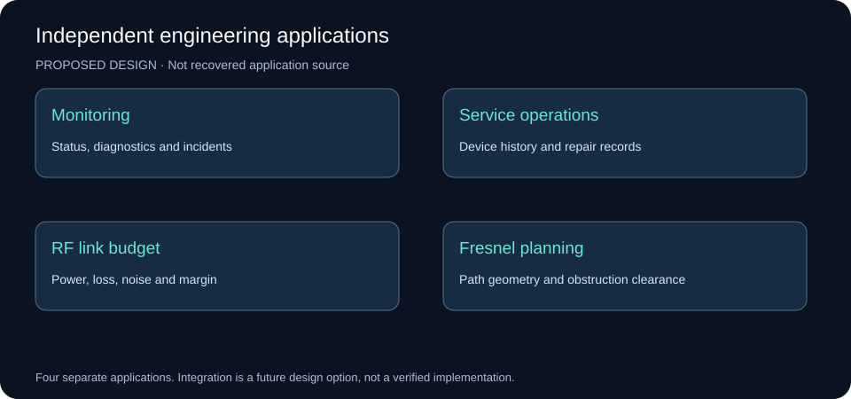
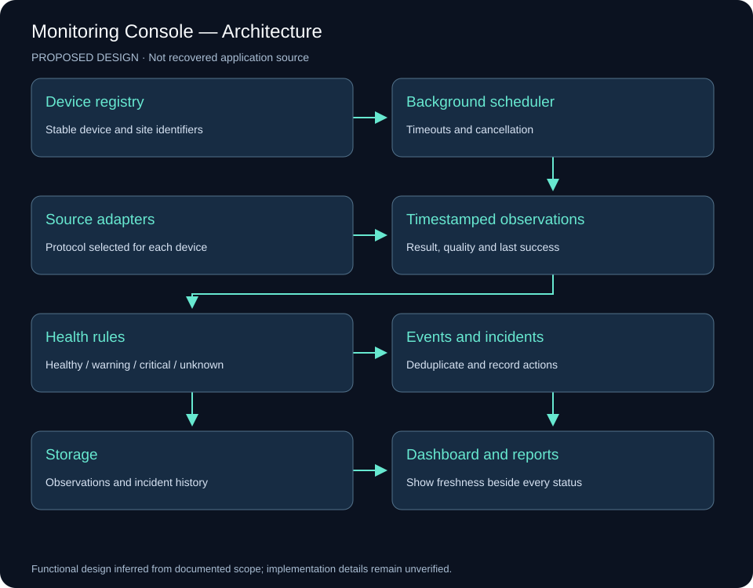
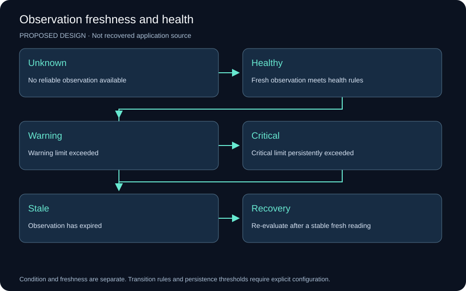
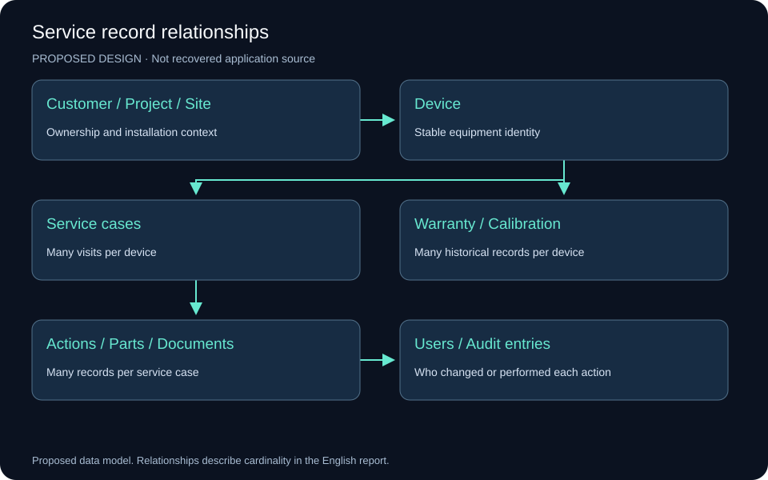
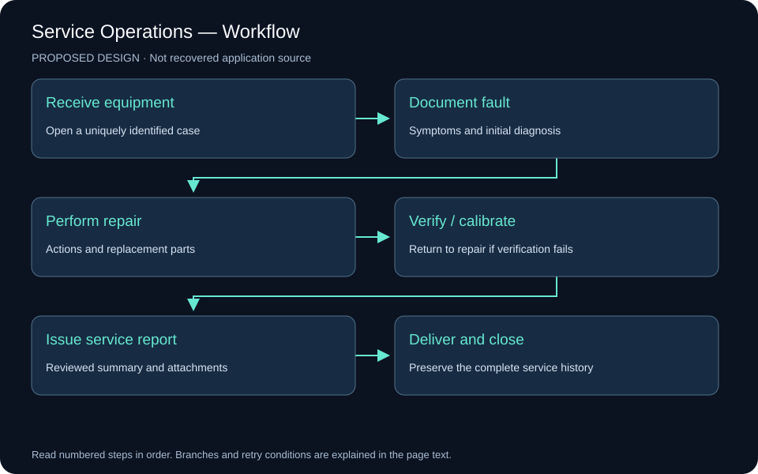
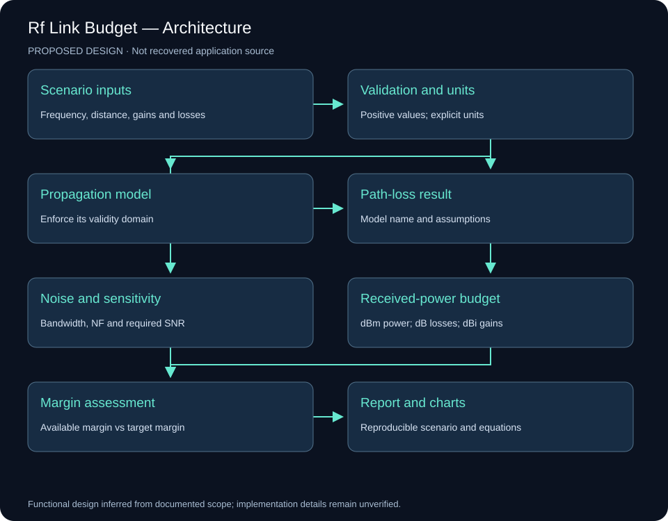
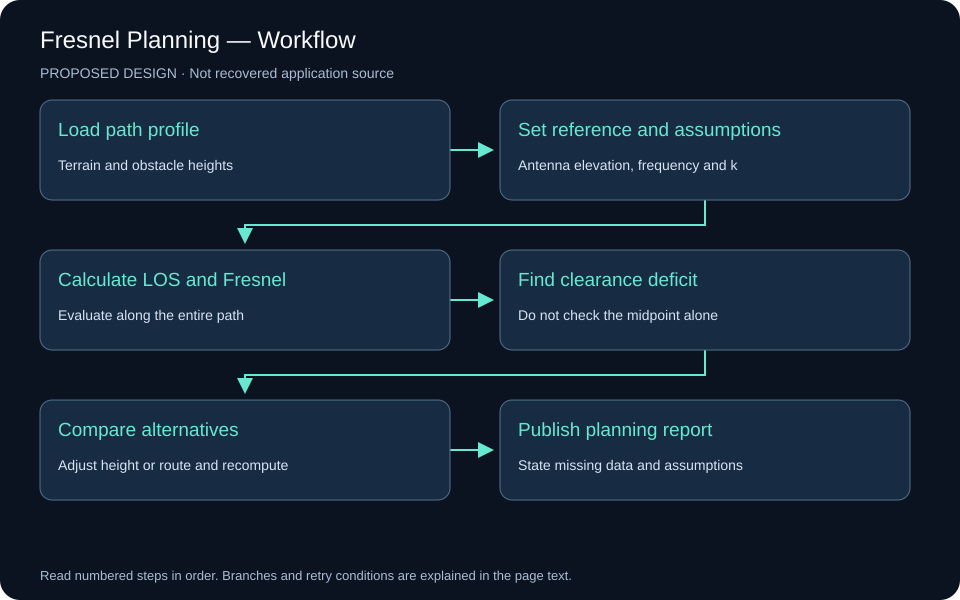
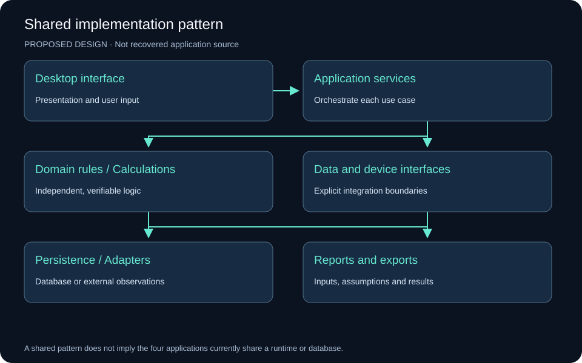

# Engineering Software — Independent Applications

Interface analysis, proposed system designs, workflows, and calculation review

## Evidence and scope

This analysis uses the README in Mahyoub88/dotnet-monitoring-apps, the four portfolio case-study pages, and their original images. The material documents four independent applications. It does not establish that they share a database, communicate with one another, or form a single deployed system.

The visible repository root contains documentation and images, rather than application source projects. Accordingly, the designs below are proposals based on documented functions. They are not recovered implementation details or evidence that the applications passed the proposed checks. No field measurements, uptime figures, or performance benchmarks are inferred from a screenshot.

Source: [Independent applications repository](https://github.com/Mahyoub88/dotnet-monitoring-apps).

## Application boundaries

| Application | Main problem | Inputs | Outputs |
|---|---|---|---|
| Monitoring and diagnostics | Recognizing device condition and operational issues | Device registry, observations, events | Status, alerts, incidents, reports |
| Service operations | Preserving device and repair history | Equipment identity, service visits, repair actions | Service history, documents, reports |
| RF link budget | Assessing received power and receiver margin | Frequency, distance, power, gains, losses | Path loss, receive level, noise, margin |
| LOS and Fresnel planning | Checking path geometry and obstruction clearance | Antenna elevations, terrain, obstacles, frequency | Profile, clearance deficits, alternatives |

## 1. Monitoring and Diagnostics Console

### Original-image analysis

The poster presents a main monitoring dashboard, site details and rule analysis, a connection or fault-test panel, and an event / failure-tracking view. The dashboard combines tabular records, colored status indicators and numerical summaries. The four areas support recognition, diagnosis and follow-up.

The published preview has limited resolution. Small labels, exact readings and device protocols cannot reliably be extracted. The documentation identifies VB.NET and WinForms and describes multi-site monitoring, diagnostics, health evaluation, issue tracking and reporting. Those descriptions do not establish measured performance.

### Proposed architecture

Separate the desktop view from the background scheduler, device adapters, health rules, event storage, incident management and reporting. The scheduler runs time-limited checks without blocking the interface. Each observation includes its device, check type, timestamp, result and quality.

Display condition and observation freshness separately. An unsuccessful network check does not alone prove hardware failure. Use healthy, warning, critical, unknown and stale states; show the last successful observation. An expired observation must not remain a fresh green status.

Suggested records are Site, Device, ProbeResult, HealthRule, Event, Incident and IncidentAction. A device has many observations. Repeated events may belong to one incident. Record state transitions, aggregate repeated failures and configure persistence thresholds before raising an alert. Confirm stable recovery before closing an incident.

The workflow is device registration, background collection, evaluation, state-change recording, investigation, recovery confirmation and reporting. A protocol adapter is selected according to the actual equipment; no particular protocol is assumed from the low-resolution image.

### Verification requirements

Exercise unavailable devices, slow responses, stale readings, database failure, recovery and shutdown during an active check. The interface must stay responsive, identify uncertainty and preserve recorded events. Test cancellation and avoid overlapping checks that produce contradictory state updates.

## 2. Service Operations and Technical Documentation

### Original-image analysis

The screenshot shows device type, article number, serial number, site, RMA or service-call number, service status, receipt and repair dates. It also shows project, customer, region, warranty, expiry and calibration validity, return reasons, corrective-action summary, repair type and personnel, document-forwarding fields, status and a customer report.

New, modify, save, delete and search controls sit above the record grid. Selecting a row provides a natural way to load a record for review. The poster names VB.NET, WinForms, ADO.NET, Crystal Reports and SQL Server / Access. It does not establish which database engine the particular implementation uses.

### Proposed data model

Keep equipment identity separate from a service visit. One device can have multiple visits and repairs. Customer, Project and Site define the ownership and installation context. Device has many ServiceCase records; each case has RepairAction, PartReplacement and Document records. Warranty and Calibration retain their historical validity records. Users and audit entries identify actions and changes.

Use stable internal keys rather than names as relationships. Record actual event dates separately from entry timestamps. Keep internal engineering notes separate from the reviewed customer report. Renewing calibration must not erase the previous certificate or validity record.

### Workflow and integrity

Receive equipment, document the fault, diagnose it, perform the repair, verify or calibrate as required, issue a reviewed report, then deliver and close the case. Failed verification returns the case to diagnosis or repair.

Use unique service-case numbers and controlled status transitions. Reject a repair date before receipt. Save a case and related actions in one transaction. Use parameterized database operations, an audit history and concurrent-edit conflict detection. Records associated with issued reports should retain their history through archival rather than silent deletion.

A proposed interface uses search and a record list beside tabs for device identity, service visit, repairs and parts, warranty and calibration, and documents. Show current status prominently and make the change history accessible. This layout is a redesign proposal, not a description of an unpublished version.

### Verification requirements

Check two visits for the same device, calibration renewal with preserved history, two users editing the same case, and failed attachment storage. A stale edit must not silently overwrite a more recent change. A failed transaction must not leave a partly saved case.

## 3. RF Link Budget and Propagation Analysis

### Original-image analysis

The poster shows a transmitter and receiver and inputs for frequency, distance, antenna heights, transmit power, antenna gains, cable losses, polarization loss, system margin, terrain and the effective-Earth factor. Five result groups cover path loss, Fresnel clearance, link budget, receiver sensitivity and received power against distance.

The poster names FSPL, Hata, Okumura and ITU-R P.1546. Naming models does not establish that their implementation or use is valid. Each model must declare and enforce its frequency, geometry and environment domain. Coverage models must not automatically be treated as equivalent alternatives for a point-to-point microwave path.

### Proposed calculation engine

Separate calculations from WinForms button events. Validate inputs, normalize units, select an applicable model, calculate path loss and received power, evaluate receiver requirements, then report results with the original assumptions and model version.

Keep power in dBm, gains in dBi and losses and margins in dB. Use explicit variable names or unit-aware values. Convert units at clear boundaries and avoid mixing Hz with MHz or metres with kilometres.

For frequency in MHz and distance in km:

`FSPL (dB) = 32.44 + 20 log10(fMHz) + 20 log10(dkm)`

`EIRP (dBm) = Pt + Gt − Lt`

`Pr (dBm) = Pt + Gt + Gr − Lt − Lr − Lpath − Lother`

`Available margin (dB) = Pr − receiver sensitivity`

The fade-margin target is a requirement against which available margin is compared. Display the available margin and the remainder after that target as separate quantities. Do not subtract the target and give the result the same undefined name.

Reference: [ITU-R P.525, free-space attenuation](https://www.itu.int/dms_pubrec/itu-r/rec/p/R-REC-P.525-5-202411-I%21%21PDF-E.pdf). Its rounded constant of 32.4 causes only a small rounding difference.

### Independent review of the poster values

Visible inputs are 5800 MHz, 5.02 km, 20 dBm transmit power, 15 dBi gain at each end, 1 dB cable loss at each end and receiver sensitivity of −85 dBm. Assuming free-space propagation and no additional losses:

| Quantity | Poster value | Recalculated value |
|---|---:|---:|
| EIRP | 34 dBm | 34 dBm |
| Free-space loss | 120.535 dB | 121.72 dB |
| Received power | −72.535 dBm | −73.72 dBm |
| Margin above −85 dBm | About 12.46 dB | 11.28 dB |
| Remainder after a 10 dB target | Not separately defined | 1.28 dB |

The displayed received power is consistent with the displayed loss, but that loss is inconsistent with the visible frequency and distance. This is a discrepancy in the poster. Without application source or a reproducible run it does not identify the cause or prove a software defect. Preserve the original image as evidence and label the independently recalculated example separately.

### Noise and sensitivity

At approximately 290 K:

`Equivalent receiver noise (dBm) ≈ −174 + 10 log10(BHz) + NF`

`Calculated sensitivity = equivalent receiver noise + required SNR`

At 20 MHz bandwidth and a 5 dB noise figure, equivalent receiver noise is about −95.99 dBm. The poster’s approximately −101 dBm thermal-noise figure agrees with the value before adding noise figure. Label pre-NF thermal noise and post-NF equivalent noise separately. With required SNR of 10 dB, calculated sensitivity is approximately −85.99 dBm.

Keep calculated sensitivity separate from datasheet sensitivity. Modulation, coding, reception-success criteria and implementation can affect the datasheet requirement. The poster’s C/N field also needs an explicit definition before accepting it as a verified result.

### Verification requirements

Use independent reference scenarios. Doubling frequency or distance should increase FSPL by approximately 6.02 dB. Adding 1 dB cable loss should reduce received power by 1 dB. Equivalent unit conversions must preserve results. Reject nonpositive frequency and distance and unsupported model inputs. A GOOD label is an assessment output, not a calculation test.

## 4. Line-of-Sight and Fresnel Planning

### Original-image analysis

The source image is a concept illustration showing two antennas, a dashed direct path, buildings, trees and blue wave symbols. It provides no scale, terrain profile, antenna elevations, input fields or numerical clearance results. The wave symbols do not represent the geometric Fresnel envelope. The image explains the planning idea but cannot establish the clearance of a real path.

Line of sight is the direct ray between the antennas. The first Fresnel zone surrounds that ray, changes radius along the path and has its largest radius near the midpoint. The ray may be clear while an obstacle still intrudes into the surrounding zone, so evaluate the entire path.

### Proposed geometry engine

Use endpoint antenna elevations on a common vertical reference, sampled terrain, obstacle heights, frequency, effective-Earth factor k and a stated clearance target.

`λ = c / f`

`First Fresnel radius = sqrt(λ × d1 × d2 / (d1 + d2))`

`LOS elevation(x) = Ht + (Hr − Ht) × x / D`

`Earth bulge(x) ≈ x × (D − x) / (2 × k × RE)`

`Available clearance = LOS − terrain − obstacle − Earth bulge`

Use metres for every length and Hz for frequency. Apply the curvature correction only when the imported profile has not already incorporated it. State the vertical reference and curvature method to prevent double correction. Review other k assumptions where the planning requirement calls for them.

A 60% first-zone clearance is an initial planning criterion, subject to path, refraction and availability assumptions. It does not guarantee every link’s performance. Reference: [ITU-R P.530, line-of-sight path-clearance considerations](https://www.itu.int/dms_pubrec/itu-r/rec/p/R-REC-P.530-18-202109-I%21%21PDF-E.pdf).

### Recalculated geometry example

Using the RF poster’s 5.02 km distance and 5.8 GHz frequency gives a midpoint first-zone radius of approximately 8.05 m; 60% is approximately 4.83 m. The poster’s 7.15 m radius and 6.43 m required clearance do not match that scenario and criterion. Its 8.30 m available clearance cannot be checked without terrain, obstacle and elevation-reference data. Antenna height above local ground is insufficient by itself.

### Proposed planning interface

Plot distance against elevation. Show terrain, obstacles, the direct ray, Fresnel bounds and the clearance target. Provide a critical-point table with distance from the transmitter, obstacle elevation, available clearance and deficit. Selecting a row should highlight its location on the profile. Compare antenna-height and route alternatives by recalculating the entire path.

### Verification requirements

Check an unobstructed profile, a midpoint obstacle, an obstacle near an endpoint, unequal ground elevations and different k values. Reversing endpoints with equivalent data should preserve the assessment. A missing profile must be shown as missing evidence rather than reported as a clear path.

## 5. Implementation pattern

The documented desktop technologies can support the proposed designs. Keep user-interface events separate from application services and domain logic. Data adapters manage storage and external sources. Reporting produces readable results from persisted records or calculation scenarios.

The operational priorities differ: monitoring needs responsive background work and freshness handling; service records need transactions and durable history; RF and Fresnel tools need explicit units, applicable models and independently reproducible calculations. A common architectural pattern does not mean the four applications share a runtime or database.

The RF calculator does not need a database to calculate a single scenario. Persistence is useful for saved scenarios, comparisons and report reproduction. Future integration could link a monitoring incident to a service case or exchange an RF scenario with a planning tool, but the available evidence does not establish that integration today.

## 6. Documentation and presentation improvements

1. Keep the collection as an entry point and maintain a distinct detailed page for each application.
2. Present readable interface captures beside dense source posters. Identify low-resolution limitations.
3. Caption every image with its purpose and evidentiary scope.
4. Provide responsibilities, data relationships, workflows and verification scenarios instead of generic three-box diagrams alone.
5. Preserve the original RF image while publishing a separately labeled, consistent recalculated example.
6. Use a scaled, calculated terrain profile for Fresnel results and retain the concept image in the source gallery.
7. Distinguish documented functions, proposed designs and verified execution results.

## 7. Completion and remaining evidence

The image analysis, proposed architecture and data models, workflow diagrams and independent review of the displayed calculation scenario are complete. These additions improve documentation; they do not modify or validate the original application code. Verifying the actual software requires source solutions, schema definitions and suitable test data or reproducible builds.

## Source pages

- [Application collection](https://mahyoub88.github.io/projects/proj-monitoring-apps/)
- [Monitoring console](https://mahyoub88.github.io/projects/proj-monitoring-console/)
- [Service operations](https://mahyoub88.github.io/projects/proj-service-operations/)
- [RF link budget](https://mahyoub88.github.io/projects/proj-rf-link-budget/)
- [Fresnel planning](https://mahyoub88.github.io/projects/proj-fresnel-planning/)
