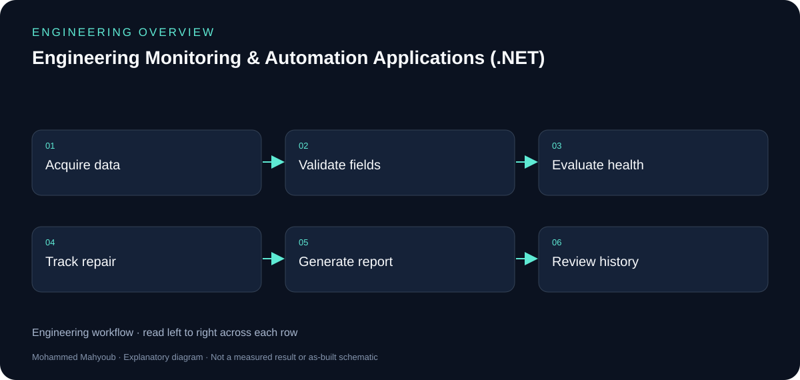
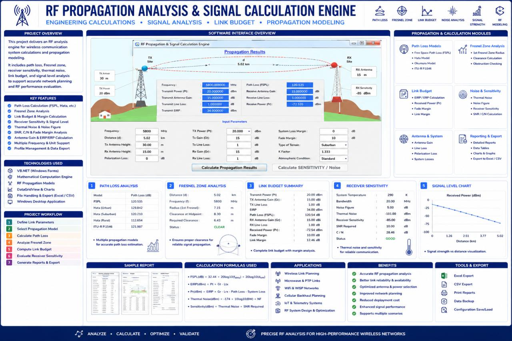
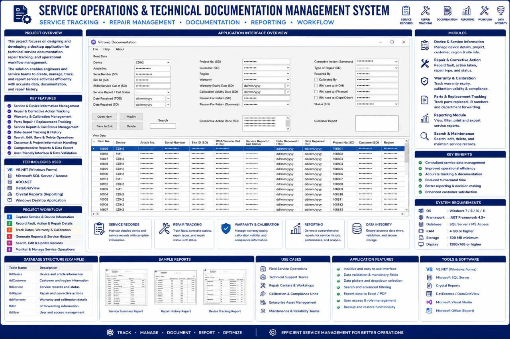
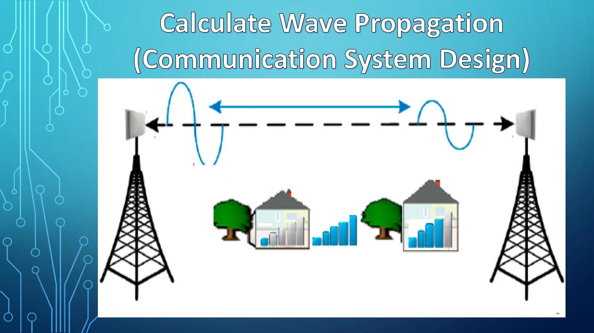

# Engineering Monitoring & Automation Applications (.NET) — Engineering Guide

Developed VB.NET desktop applications and engineering tools for system monitoring, service documentation, repair tracking, operational reporting, device integration, and RF analysis.

## Visual overview

*New explanatory diagram; grouped responsibilities, not an as-built schematic or test result.*

*New explanatory workflow; a documentation aid, not evidence that every proposed check was performed.*

## Operational monitoring and service records

The application portfolio includes live system diagnostics and service-documentation workflows. The service-management source image shows device records, repair details, warranty/calibration fields, search and reporting. These functions should be explained as related applications rather than assumed to be one identical screen.

## Engineering calculation tools

The RF tool covers path loss, receiver sensitivity, thermal noise and link budget. A separate planning view covers line-of-sight and Fresnel clearance. Inputs, units and assumptions are essential to interpreting a calculator result.

## Public evidence

The gallery reuses project media already attached to LinkedIn. It provides visual evidence of the applications; the diagrams added here explain responsibilities and workflow. Application source code and database exports are not included in this repository.

## Evidence to review or collect

The following are suggested review checks. A checklist entry is not a claimed pass result.

- Input validation and unit handling.
- Device health versus stale/unreachable data.
- Service record create/search/report workflow.
- Calculator result with input assumptions.

## Source gallery

*RF Link Budget & Propagation Analysis Engine — LinkedIn project media.*

*Service Operations & Technical Documentation Management System — LinkedIn project media.*

*Line-of-Sight & Fresnel Zone Wireless Planning Tool — LinkedIn document page.*

## Sources and provenance

- [Published portfolio description](https://mahyoub88.github.io/#proj-monitoring-apps).
- [Project README](../README.md) and existing repository files.
- [LinkedIn projects](https://www.linkedin.com/in/mohammed-mahyoub/details/projects/): supplementary descriptions and project media.
- New SVG figures and explanatory text were authored for this documentation update; they are not original photographs or new measured results.
- Reused JPG media were exported from the corresponding LinkedIn project media viewer. Source titles are preserved in the captions; no expiring image URLs are required.
